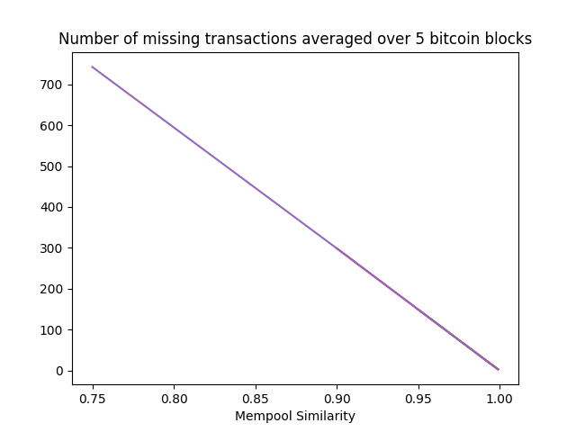

# Graphene Tests

We are trying to test block propagation using graphene with data from real Bitcoin blocks while following the actual wire protocol of Bitcoin. A new message type called MSG_GRAPHENE has been added and a new transaction packet called GraphenePacket has been added which can be serialized and deserialized. This packet includes the bloom filter and the IBLT that are needed as part of graphene.

### First Results*

#### Comparision of different bandwidth saving techniques



\* I'm still tuning different parameters. While the actual numbers may change as testing progresses, the trend should hold. Numbers for Compact and Xtreme Thinblocks are estimates and not pulled from actual messages.

### TODO

* Unrecoverable transactions.

### Running stuff

``get_data.py`` fetches one bitcoin block at a time. It remembers what it has fetched so it can be run multiple times to increase our dataset.

__Note__: We use the Blocktrail's API to fetch blocks from Bitcoin's main chain. get_data script requires an API key and secret set as environment variables BLOCKTRAIL_KEY and BLOCKTRAIL_SECRET.

```bash
~/graphene$ python get_data.py
Fetching transactions for block 00000000000000000017550c02d6a651c7a79b54c07d4a33b55c5f88c9bf8e3d
There are a total of 3114 transactions in this block
Fetched 100 transactions
...
```

Data is written to the ``data`` directory:
```bash
~/graphene$ ls data/
499327.json
```

Block propagation is simulated using two scripts, one simulates a node receiving the block and another simulates the sender.

The receiving block has a few transactions from the current block missing from its mempool. We can control this number when starting the script.

```bash
~/graphene$ python miner_without_block.py data/499327.json 0.9
2017-12-14 22:27:39,323 - root - INFO - Read 3114 transactions
2017-12-14 22:27:39,324 - root - INFO - Selecting 2802 transactions at random for inclusion in mempool
2017-12-14 22:27:39,332 - root - INFO - Skipped 311 transactions
2017-12-14 22:27:39,333 - root - DEBUG - Socket bound to localhost:4242
2017-12-14 22:27:46,913 - root - DEBUG - Accepted incoming connection from 127.0.0.1:37178
2017-12-14 22:27:49,916 - root - INFO - Sending verack now
2017-12-14 22:27:49,917 - root - INFO - Received graphene inv with hash ... 
2017-12-14 22:27:49,918 - root - INFO - Sending getdata
2017-12-14 22:27:50,053 - root - INFO - Graphene received!
...
```
The two arguments are the file containing the block data and mempool similarity between the two nodes expressed as a number between 0 and 1.


The other script only needs the block file since it loads all transactions.
```bash
~/graphene $ python miner_with_block.py data/499327.json
2017-12-14 17:38:20,675 - root - INFO - Read 3114 transactions
2017-12-14 17:38:20,677 - root - DEBUG - Connecting to localhost:4242
2017-12-14 17:38:23,769 - root - INFO - verack handled
2017-12-14 17:38:23,770 - root - INFO - Received mempool size as 2959
Mempool difference 155
n_cells 236
2017-12-14 17:38:23,770 - root - INFO - Calculated FPR: 0.100000
2017-12-14 17:38:23,890 - root - INFO - Number of bits in the bloom filter: 14924
```

The simulation scripts can be run over one block at a time. ``driver.py`` runs the scripts for all blocks in the ``data`` directory for mempool values ``[0.999, 0.99, 0.95, 0.9, 0.75]``. It remembers if it has processed a block before so it can be safely run as many times as needed.

```bash
~/graphene $ python driver.py
Computing values for block 499327
2017-12-14 17:48:24,879 - root - INFO - Read 3114 transactions
2017-12-14 17:48:24,880 - root - INFO - Selecting 3110 transactions at random for inclusion in mempool
2017-12-14 17:48:24,883 - root - INFO - Skipped 3 transactions
2017-12-14 17:48:24,891 - root - DEBUG - Socket bound to localhost:4242
```

Graphs can be generated as follows:
```bash
~/graphene $ python graph.py 
[0.999, 0.99, 0.95, 0.9, 0.75]
[1.6027018229166667, 20.1650390625, 107.61090959821429, 183.95354352678572, 443.32975260416669]
[0.999, 0.99, 0.95, 0.9, 0.75]
[3.2353515625, 4.822591145833333, 11.998465401785714, 20.963588169642858, 47.535807291666664]
[0.999, 0.99, 0.95, 0.9, 0.75]
[17.49609375, 17.49609375, 17.615792410714285, 17.615792410714285, 17.49609375]
[0.999, 0.99, 0.95, 0.9, 0.75]
[24.948893229166668, 24.948893229166668, 25.120396205357142, 25.120396205357142, 24.948893229166668]
```
